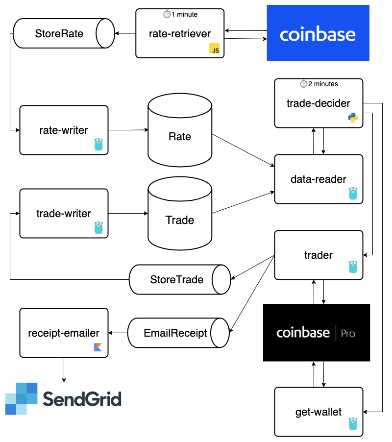

# kripto ₿ 💰 💸 🤑 🏴󠁧󠁢󠁷󠁬󠁳󠁿

Kripto ₿ trading platform, periodically checks the BTC-GBP exchange rate using Coinbase APIs and makes intelligent decisions whether to buy/sell Bitcoin. Executes trades using Coinbase Pro.

## Architecture 🏛 

## Functions λ

| Function                                                | Service                                     | Runtime       | Events             | Description                                                                            |
| ------------------------------------------------------- | ------------------------------------------- | ------------- | ------------------ | -------------------------------------------------------------------------------------- |
| [rate-retriever](./services/rate-retriever)             | [rate-retriever](./services/rate-retriever) | Node.js       | Schedule           | Retrieves the BTC-GBP exchange rate from Coinbase and publishes result to SNS.         |
| [trade](./services/trader/cmd/trade)                    | [trader](./services/trader)                 | Go            | Invocation         | Calls Coinbase Pro to make a BTC-GBP trade and publishes result to SNS.                |
| [rate-writer](./services/data-storer/cmd/rate-writer)   | [data-storer](./services/data-storer)       | Go            | SQS                | Stores a trade in the database.                                                        |
| [trade-writer](./services/data-storer/cmd/trade-writer) | [data-storer](./services/data-storer)       | Go            | SQS                | Stores a rate in the database.                                                         |
| [data-reader](./services/data-storer/cmd/data-reader)   | [data-storer](./services/data-storer)       | Go            | Invocation         | Gets the previous week's rates from the database and returns in the response.          |
| [trade-decider](./services/trade-decider)               | [trade-decider](./services/trade-decider)   | Python        | SQS                | Makes an intelligent decision whether or not to trade BTC-GBP based on historic rates. |

### Rate Retriever ₿↔￡

- **Language** - JavaScript
- **Runtime** - nodejs12.x
- **Event** - Scheduled - every minute
- **Services** - AWS Lambda, Serverless, SQS (Producer), Coinbase API

##### Request
    {}

##### Response 
    {}
    
### Trade 🤝

- **Language** - Go
- **Runtime** - go1.x
- **Event** - Invocation
- **Services** - AWS Lambda, Serverless, SQS (Producer), Coinbase Pro API

##### Request
    {
        "tradeType": "buy",
        "amount": "10.00"
    }

##### Response 
    {}

### Rate Writer 💰

- **Language** - Go
- **Runtime** - go1.x
- **Event** - SQS - `RateUpdate` queue
- **Services** - AWS Lambda, Serverless, SQS (Consumer), MongoDB
- **Idempotency** - `idempotencyKey` sent in message payload

##### Request
    {
        "idempotencyKey": "aa368788-bb4f-40c0-b80f-afcfdaf18574",
        "rate": "8012.92",
        "dateTime": "2020-05-19T19:39:00"
    }

##### Response 
    {}

### Trade Writer 💸

- **Language** - Go
- **Runtime** - go1.x
- **Event** - SQS - `Trade` queue
- **Services** - AWS Lambda, Serverless, SQS (Consumer), MongoDB
- **Idempotency** - trade ID (`id`) in message payload used as idempotency key

##### Request
    {
        "id": "aa368788-bb4f-40c0-b80f-afcfdaf18574",
        "side": "buy",
        "productId": "BTC-GBP",
        "funds": "9.95024875",
        "settled": true,
        "createdAt": "2020-05-19T19:39:00",
        "fillFees": "0.049751102976",
        "filledSize": "0.00125952",
        "executedValue": "9.9502205952"
    }

##### Response 
    {}
    
### Data Reader 💷

- **Language** - Go
- **Runtime** - go1.x
- **Event** - Invocation
- **Services** - AWS Lambda, Serverless, MongoDB

##### Request
    {}

##### Response 
    [{
        "id": "5ecf261e05a7428989286075",
        "rate": 7553.79,
        "dateTime": "2020-05-28T02:44:53.437Z",
    }, {
        "id": "5ecf270d05a7428989286079",
        "rate": 7548.3,
        "dateTime": "2020-05-28T02:50:53.776Z",
    }]
    
### Trade Decider 🤔

- **Language** - Python
- **Runtime** - python3.8
- **Event** - SQS - `InitiateTrade` queue
- **Services** - AWS Lambda, Serverless, SQS (Consumer)
- **Idempotency** - `idempotencyKey` sent in message payload

##### Request
    {
        "idempotencyKey": "aa368788-bb4f-40c0-b80f-afcfdaf18574",
        "rate": "8012.92",
        "dateTime": "2020-05-19T19:39:00"
    }

##### Response 
    {}
    
## Events 🚀

### Trade

- **Description** - Signifies a trade has taken place
- **SQS Queues**
    - `StoreTrade`
- **Publisher** - trader
- **Subscribers**
    - trade-writer

##### Payload
    {
        "id": "aa368788-bb4f-40c0-b80f-afcfdaf18574",
        "side": "buy",
        "productId": "BTC-GBP",
        "funds": "9.95024875",
        "settled": true,
        "createdAt": "2020-05-19T19:39:00",
        "fillFees": "0.049751102976",
        "filledSize": "0.00125952",
        "executedValue": "9.9502205952"
    }
    
### RateUpdate

- **Description** - Signifies a rate update event
- **SQS Queues**
    - `StoreRate`
    - `InitiateTrade`
- **Publisher** - rate-retriever
- **Subscribers**
    - rate-writer
    - trade-decider

##### Payload
    {
        "idempotencyKey": "aa368788-bb4f-40c0-b80f-afcfdaf18574",
        "rate": "8012.92",
        "dateTime": "2020-05-19T19:39:00"
    }